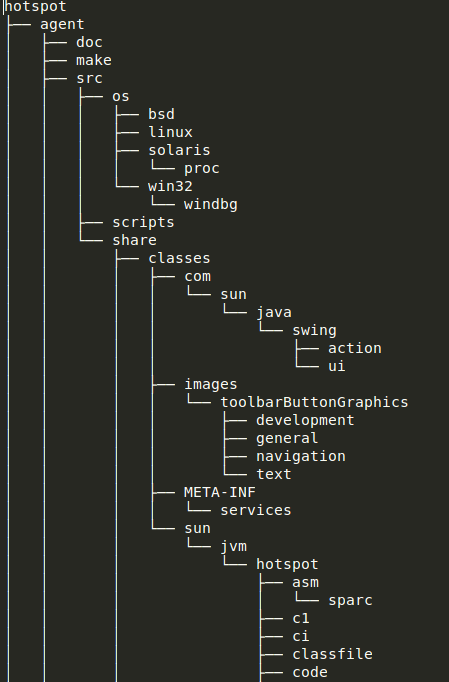

# OpenJDK8 directory structures

See directory structure of various OpenJDK projects
(download the tree command for Ubuntu or install it via ```sudo apt-get install tree```)

Below are full or partial outputs of the output from the tree command:
 
**OpenJDK (level 1)** <br/>
```$ tree -L 1 -d``` <br/>


**OpenJDK (level 2)** <br/>
```$ tree -L 2 -d``` <br/>
![[[image or output of above command]]](OpenJDKDirStructureLevel2.png)

**build (level 3)** <br/>
```
$ tree -L 3 -d build
build
└── linux-x86_64-normal-server-release
    ├── corba              ⇐ Common Object Request Broker Architecture
    │   ├── btclasses
    │   ├── btjars
    │   ├── classes
    │   ├── dist
    │   ├── gensrc
    │   ├── lib
    │   └── logwrappers
    ├── hotspot                       ⇐ Java, the platform (one part)
    │   ├── dist
    │   ├── linux_amd64_compiler2
    │   └── linux_amd64_docs
    ├── images
    │   ├── j2re-image            ⇐ this folder contains Java 8 JRE 
    │   ├── j2sdk-image           ⇐ this folder contains Java 8 JDK
    │   ├── lib
    │   ├── local_policy_jar.tmp
    │   ├── src
    │   ├── _strip_jdk
    │   ├── _strip_jre
    │   ├── symbols
    │   ├── unsigned
    │   └── US_export_policy_jar.tmp
    ├── jaxp               ⇐ Java API for XML Processing
    ├── jaxws              ⇐ Java API for Web Services
    ├── jdk                ⇐ Java, the language (other part)
    ├── langtools          ⇐ supporting tools for Java, the language
    ├── nashorn            ⇐ Javascript Runtime for the JVM
    └── tmp
```
Folder jaxp onwards the tree structure has been collapsed to enabling fitting of the build folder structure on this page.

**Hotspot (all levels)**  <br/>
```$ tree -d hotspot```<br/>


Only a partial view of the hotspot structure has been displayed on this page to enable us to fit the overview.