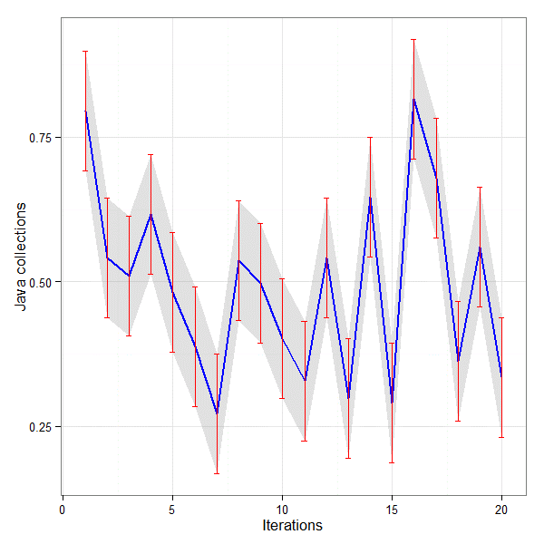
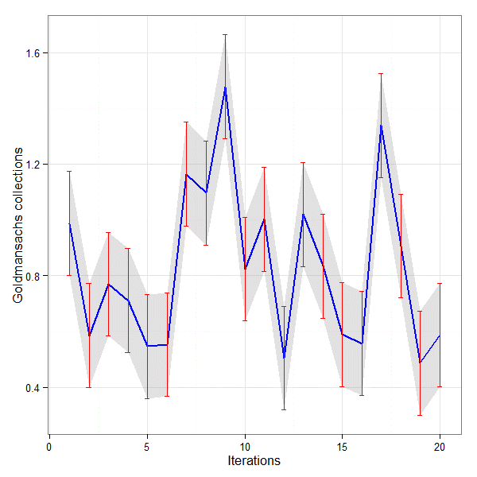

#JMH: Java Microbenchmarking Harness

[JMH](http://openjdk.java.net/projects/code-tools/jmh/) is a micro benchmarking tool for Java and other JVM languages.

These tests are typically in the nanosecond range with thousands of executions. The tested code usually performs a small task.

#Blog Posts

##Maven POM

`

    <project xmlns="http://maven.apache.org/POM/4.0.0" xmlns:xsi="http://www.w3.org/2001/XMLSchema-instance"
         xsi:schemaLocation="http://maven.apache.org/POM/4.0.0 http://maven.apache.org/maven-v4_0_0.xsd">
    <modelVersion>4.0.0</modelVersion>
    <groupId>jmh-benchmark</groupId>
    <artifactId>oracle-stream-javaone-14</artifactId>
    <packaging>jar</packaging>
    <version>1.0-SNAPSHOT</version>
    <name>Oracle Stream JavaOne 2014</name>

    <dependencies>
        <dependency>
            <groupId>org.openjdk.jmh</groupId>
            <artifactId>jmh-core</artifactId>
            <version>1.1</version>
        </dependency>
        <dependency>
            <groupId>org.openjdk.jmh</groupId>
            <artifactId>jmh-generator-annprocess</artifactId>
            <version>1.1</version>
        </dependency>
        <dependency>
            <groupId>org.openjdk.jol</groupId>
            <artifactId>jol-core</artifactId>
            <version>0.1</version>
        </dependency>
        <dependency>
            <groupId>junit</groupId>
            <artifactId>junit</artifactId>
            <version>4.11</version>
            <scope>test</scope>
        </dependency>
        <dependency>
            <groupId>org.apache.maven.plugins</groupId>
            <artifactId>maven-antrun-plugin</artifactId>
            <version>1.3</version>
        </dependency>
        <dependency>
            <groupId>org.apache.maven.plugins</groupId>
            <artifactId>maven-assembly-plugin</artifactId>
            <version>2.2-beta-5</version>
        </dependency>
        <dependency>
            <groupId>org.apache.maven.plugins</groupId>
            <artifactId>maven-surefire-plugin</artifactId>
            <version>2.12.4</version>
        </dependency>
        <dependency>
            <groupId>org.apache.maven.plugins</groupId>
            <artifactId>maven-site-plugin</artifactId>
            <version>3.3</version>
        </dependency>
        <dependency>
            <groupId>org.apache.maven.plugins</groupId>
            <artifactId>maven-resources-plugin</artifactId>
            <version>2.6</version>
        </dependency>
        <dependency>
            <groupId>org.apache.maven.plugins</groupId>
            <artifactId>maven-release-plugin</artifactId>
            <version>2.3.2</version>
        </dependency>
        <dependency>
            <groupId>org.apache.maven.plugins</groupId>
            <artifactId>maven-jar-plugin</artifactId>
            <version>2.4</version>
        </dependency>
        <dependency>
            <groupId>org.apache.maven.plugins</groupId>
            <artifactId>maven-install-plugin</artifactId>
            <version>2.4</version>
        </dependency>
        <dependency>
            <groupId>org.apache.maven.plugins</groupId>
            <artifactId>maven-deploy-plugin</artifactId>
            <version>2.7</version>
        </dependency>
        <dependency>
            <groupId>org.apache.maven.plugins</groupId>
            <artifactId>maven-dependency-plugin</artifactId>
            <version>2.8</version>
        </dependency>
        <dependency>
            <groupId>org.apache.maven.plugins</groupId>
            <artifactId>maven-compiler-plugin</artifactId>
            <version>2.5.1</version>
        </dependency>
        <dependency>
            <groupId>org.apache.maven.plugins</groupId>
            <artifactId>maven-clean-plugin</artifactId>
            <version>2.5</version>
        </dependency>
        <dependency>
            <groupId>org.apache.maven.plugins</groupId>
            <artifactId>maven-assembly-plugin</artifactId>
            <version>2.2-beta-5</version>
        </dependency>
        <dependency>
            <groupId>org.apache.maven.plugins</groupId>
            <artifactId>maven-antrun-plugin</artifactId>
            <version>1.3</version>
        </dependency>
        <dependency>
            <groupId>org.apache.maven.plugins</groupId>
            <artifactId>maven-clean-plugin</artifactId>
            <version>2.5</version>
        </dependency>
        <dependency>
            <groupId>org.apache.maven.plugins</groupId>
            <artifactId>maven-compiler-plugin</artifactId>
            <version>2.5.1</version>
        </dependency>
        <dependency>
            <groupId>org.apache.maven.plugins</groupId>
            <artifactId>maven-dependency-plugin</artifactId>
            <version>2.8</version>
        </dependency>
        <dependency>
            <groupId>org.apache.maven.plugins</groupId>
            <artifactId>maven-deploy-plugin</artifactId>
            <version>2.7</version>
        </dependency>
        <dependency>
            <groupId>org.apache.maven.plugins</groupId>
            <artifactId>maven-install-plugin</artifactId>
            <version>2.4</version>
        </dependency>
        <dependency>
            <groupId>org.apache.maven.plugins</groupId>
            <artifactId>maven-jar-plugin</artifactId>
            <version>2.4</version>
        </dependency>
        <dependency>
            <groupId>org.apache.maven.plugins</groupId>
            <artifactId>maven-release-plugin</artifactId>
            <version>2.3.2</version>
        </dependency>
        <dependency>
            <groupId>org.apache.maven.plugins</groupId>
            <artifactId>maven-resources-plugin</artifactId>
            <version>2.6</version>
        </dependency>
        <dependency>
            <groupId>org.apache.maven.plugins</groupId>
            <artifactId>maven-site-plugin</artifactId>
            <version>3.3</version>
        </dependency>
        <dependency>
            <groupId>org.apache.maven.plugins</groupId>
            <artifactId>maven-surefire-plugin</artifactId>
            <version>2.12.4</version>
        </dependency>
        <dependency>
            <groupId>com.goldmansachs</groupId>
            <artifactId>gs-collections-api</artifactId>
            <version>6.2.0</version>
        </dependency>

        <dependency>
            <groupId>com.goldmansachs</groupId>
            <artifactId>gs-collections</artifactId>
            <version>6.2.0</version>
        </dependency>

        <dependency>
            <groupId>com.goldmansachs</groupId>
            <artifactId>gs-collections-testutils</artifactId>
            <version>6.2.0</version>
            <scope>test</scope>
        </dependency>

        <dependency>
            <groupId>com.goldmansachs</groupId>
            <artifactId>gs-collections-forkjoin</artifactId>
            <version>6.2.0</version>
        </dependency>
    </dependencies>
    <build>
        <plugins>
            <plugin>
                <groupId>com.googlecode.maven-download-plugin</groupId>
                <artifactId>download-maven-plugin</artifactId>
                <version>1.2.0</version>
                <executions>
                    <execution>
                        <id>download-ulysses</id>
                        <phase>process-resources</phase>
                        <goals>
                            <goal>wget</goal>
                        </goals>
                        <configuration>
                            <url>http://www.gutenberg.org/ebooks/4300.txt.utf-8</url>
                            <outputDirectory>${project.basedir}</outputDirectory>
                            <outputFileName>Ulysses.txt</outputFileName>
                        </configuration>
                    </execution>
                </executions>
            </plugin>
            <plugin>
                <groupId>org.apache.maven.plugins</groupId>
                <artifactId>maven-compiler-plugin</artifactId>
                <version>2.3.2</version>
                <configuration>
                    <source>1.8</source>
                    <target>1.8</target>
                </configuration>
            </plugin>
            <plugin>
                <groupId>org.apache.maven.plugins</groupId>
                <artifactId>maven-shade-plugin</artifactId>
                <version>1.5</version>
                <executions>
                    <execution>
                        <phase>package</phase>
                        <goals>
                            <goal>shade</goal>
                        </goals>
                        <configuration>
                            <finalName>microbenchmarks</finalName>
                            <transformers>
                                <transformer
                                        implementation="org.apache.maven.plugins.shade.resource.ManifestResourceTransformer">
                                    <mainClass>org.openjdk.jmh.Main</mainClass>
                                </transformer>
                                <transformer implementation="org.apache.maven.plugins.shade.resource.AppendingTransformer">
                                    <resource>META-INF/MicroBenchmarks</resource>
                                </transformer>
                            </transformers>
                        </configuration>
                    </execution>
                </executions>
            </plugin>
        </plugins>
    </build>
</project>

`

###Java code used for the Test

`

		
		class PermissionKey {
		
		    private String status;
		    private String reason;
		
		
		    public PermissionKey(String status, String reason) {
		        this.status = status;
		        this.reason = reason;
		    }
		
		    @Override public boolean equals(Object o) {
		        if (o == this)
		            return true;
		        if (!(o instanceof PermissionKey))
		            return false;
		        PermissionKey pn = (PermissionKey)o;
		        return pn.status == status
		                && pn.reason == reason;
		    }
		
		    @Override  public int hashCode(){
		        int result = 17;
		        result = 31 * result + ( status.hashCode() + reason.hashCode() );
		        return result;
		    }
		
		    public String toString(){
		        StringBuffer sb = new StringBuffer();
		        sb.append( "[" + status + "][" + reason + "]");
		        return sb.toString();
		    }
	    } 

		class Permissions{
		
		    private final String  PERMISSION = "PERMISSION";
		
		    public String toString(){
		        return PERMISSION;
		    }
		
		}

`

##JMH Benchmark

`

		import com.gs.collections.api.block.predicate.Predicate2;
		import com.gs.collections.api.list.MutableList;
		import com.gs.collections.api.map.MutableMap;
		import com.gs.collections.impl.list.mutable.FastList;
		import com.gs.collections.impl.map.mutable.UnifiedMap;
		import org.openjdk.jmh.annotations.*;
		
		import java.util.ArrayList;
		import java.util.HashMap;
		import java.util.List;
		import java.util.Map;
		import java.util.concurrent.TimeUnit;
		
		@State(Scope.Thread)
		@BenchmarkMode(Mode.AverageTime)
		@OutputTimeUnit(TimeUnit.MICROSECONDS)
		
		public class CollectionComparison {
		
		    //Java Collections
		    List<PermissionKey> firstset = new ArrayList<>();
		    List<Permissions> permissions = new ArrayList<>();
		    Map<PermissionKey, List<Permissions>> secondset = new HashMap<>();
		
		    //Goldmansachs Collections
		    MutableList<PermissionKey> gsfirstset = FastList.newList();
		    MutableList<Permissions> gspermissions = FastList.newList();
		    MutableMap<PermissionKey, MutableList<Permissions>> gssecondset =
		                                                                UnifiedMap.newMap();
		
		    @Setup
		    public void setUp() {
		        //Setup for using Java Collections
		        firstset.add(new PermissionKey("P1", "R1"));
		        firstset.add(new PermissionKey("P2", "R2"));
		        firstset.add(new PermissionKey("P3", "R3"));
		
		        permissions.add(new Permissions());
		
		        secondset.put(new PermissionKey("P1", "R1"),permissions);
		        secondset.put(new PermissionKey("P2", "R2"),permissions);
		
		        //Setup for using Goldmansachs Collections
		        gsfirstset.add(new PermissionKey("P1", "R1"));
		        gsfirstset.add(new PermissionKey("P2", "R2"));
		        gsfirstset.add(new PermissionKey("P3", "R3"));
		
		        gspermissions.add(new Permissions());
		
		        gssecondset.put(new PermissionKey("P1", "R1"),gspermissions);
		        gssecondset.put(new PermissionKey("P2", "R2"),gspermissions);
		
		    }
		
		    @Benchmark
		    public void javacollections() {
		        PermissionKey key = null;
		        Map<PermissionKey, List<Permissions>> result = new HashMap<>();
		        for (PermissionKey pkey : firstset) {
		            for (Map.Entry<PermissionKey, List<Permissions>> entry : secondset.entrySet()) {
		                key = entry.getKey();
		                if (entry.getKey().equals( pkey )) {
		                    result.put(key,entry.getValue());
		                }
		            }
		        }
		
		    }
		
		
		
		    @Benchmark
		    public void goldmansachscollections() {
		        MutableMap<PermissionKey,MutableList<Permissions>> result = gssecondset.select(
		                new Predicate2<PermissionKey,MutableList<Permissions>>() {
		                    public boolean accept(PermissionKey each,MutableList<Permissions> each1) {
		                        return gsfirstset.contains(each);
		                    }
		                });
		    }
		}
		

`

###JMH result

`

	# VM invoker: D:\Java\bin\java.exe
	# VM options: -XX:-TieredCompilation -Dbenchmark.n=10000
	# Warmup: 5 iterations, 50 ms each
	# Measurement: 20 iterations, 50 ms each
	# Timeout: 10 min per iteration
	# Threads: 1 thread, will synchronize iterations
	# Benchmark mode: Average time, time/op
	# Benchmark: oracle.stream.javaone.CollectionComparison.goldmansachscollections
	
	# Run progress: 0.00% complete, ETA 00:00:02
	# Fork: 1 of 1
	# Warmup Iteration   1: 0.443 us/op
	# Warmup Iteration   2: 0.290 us/op
	# Warmup Iteration   3: 0.343 us/op
	# Warmup Iteration   4: 0.350 us/op
	# Warmup Iteration   5: 0.388 us/op
	Iteration   1: 0.796 us/op
	Iteration   2: 0.542 us/op
	Iteration   3: 0.510 us/op
	Iteration   4: 0.617 us/op
	Iteration   5: 0.482 us/op
	Iteration   6: 0.387 us/op
	Iteration   7: 0.272 us/op
	Iteration   8: 0.536 us/op
	Iteration   9: 0.498 us/op
	Iteration  10: 0.402 us/op
	Iteration  11: 0.328 us/op
	Iteration  12: 0.542 us/op
	Iteration  13: 0.299 us/op
	Iteration  14: 0.647 us/op
	Iteration  15: 0.291 us/op
	Iteration  16: 0.815 us/op
	Iteration  17: 0.680 us/op
	Iteration  18: 0.363 us/op
	Iteration  19: 0.560 us/op
	Iteration  20: 0.334 us/op
	
	
	Result: 0.495 ¦(99.9%) 0.140 us/op [Average]
	  Statistics: (min, avg, max) = (0.272, 0.495, 0.815), stdev = 0.162
	  Confidence interval (99.9%): [0.355, 0.636]
	
	
	# VM invoker: D:\Java\bin\java.exe
	# VM options: -XX:-TieredCompilation -Dbenchmark.n=10000
	# Warmup: 5 iterations, 50 ms each
	# Measurement: 20 iterations, 50 ms each
	# Timeout: 10 min per iteration
	# Threads: 1 thread, will synchronize iterations
	# Benchmark mode: Average time, time/op
	# Benchmark: oracle.stream.javaone.CollectionComparison.javacollections
	
	# Run progress: 50.00% complete, ETA 00:00:05
	# Fork: 1 of 1
	# Warmup Iteration   1: 0.475 us/op
	# Warmup Iteration   2: 0.696 us/op
	# Warmup Iteration   3: 0.816 us/op
	# Warmup Iteration   4: 0.622 us/op
	# Warmup Iteration   5: 0.574 us/op
	Iteration   1: 0.987 us/op
	Iteration   2: 0.585 us/op
	Iteration   3: 0.770 us/op
	Iteration   4: 0.711 us/op
	Iteration   5: 0.546 us/op
	Iteration   6: 0.553 us/op
	Iteration   7: 1.164 us/op
	Iteration   8: 1.096 us/op
	Iteration   9: 1.477 us/op
	Iteration  10: 0.824 us/op
	Iteration  11: 1.002 us/op
	Iteration  12: 0.504 us/op
	Iteration  13: 1.019 us/op
	Iteration  14: 0.834 us/op
	Iteration  15: 0.589 us/op
	Iteration  16: 0.557 us/op
	Iteration  17: 1.338 us/op
	Iteration  18: 0.906 us/op
	Iteration  19: 0.486 us/op
	Iteration  20: 0.587 us/op
	
	
	Result: 0.827 ¦(99.9%) 0.252 us/op [Average]
	  Statistics: (min, avg, max) = (0.486, 0.827, 1.477), stdev = 0.291
	  Confidence interval (99.9%): [0.574, 1.079]
	
	
	# Run complete. Total time: 00:00:10
	
	
    Benchmark                                             Mode  Samples  Score  Scor
	e error  Units
	o.s.j.CollectionComparison.goldmansachscollections    avgt       20  0.495
	  0.140  us/op
	o.s.j.CollectionComparison.javacollections            avgt       20  0.827
	  0.252  us/op

###Types of Error bars used to plot the diagram

<table>
    <thead>
    <tr>
         <td>Error bars</td>
         <td>Type</td>
         <td>Description</td>
    </tr>
    </thead>
    <tr>
        <td>Standard error (SEM)</td>
        <td>Inferential</td>
        <td>A measure of how variable the mean will be, if you repeat the whole study many times.</td>
    </tr>
    <tr>
        <td>Confidence interval (CI)</td>
        <td>Inferential</td>
        <td>A range of values you can be 99% confident contains the true mean.</td>
    </tr>
</table>

I used 'R' to print the summary details of both data sets for both types of collections. This gives more details to plot other types of graphs.

<table>
    <thead>
    <tr>
         <td>Min.</td>
         <td>1st Qu.</td>
         <td>Median</td>
         <td>Mean</td>
         <td>3rd Qu.</td>
         <td>Max.</td>
    </tr>
    </thead>
    <tr>
        <td> 0.2720</td>  
		<td>0.3558</td>  
		<td>0.5040</td>  
		<td>0.4950</td>  
		<td>0.5742</td> 
		<td>0.8150</td> 
    </tr>
</table>

##### R graph showing error bars and 99% CI as a band

<table>
    <thead>
    <tr>
         <td>Min.</td>
         <td>1st Qu.</td>
         <td>Median</td>
         <td>Mean</td>
         <td>3rd Qu.</td>
         <td>Max.</td>
    </tr>
    </thead>
    <tr>

        <td>0.4860</td>  
		<td>0.5780</td>  
		<td>0.7970</td>  
		<td>0.4950</td>  
		<td>1.0060</td> 
		<td>1.4770</td> 
    </tr>
</table>

##### R graph showing error bars and 99% CI as a band

