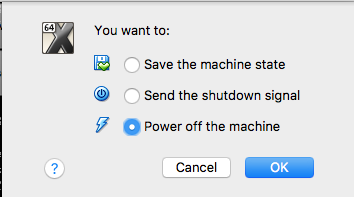
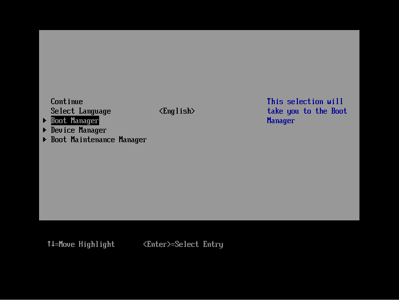

# Building OpenJDK8 on Mac.

You can see another version of this turorial [here](http://allandequeiroz.io/2017/05/15/building-openjdk-8-on-mac-inception-approach)

This is an alternative way to build OpenJDK8 on recent versions of OSx.


Different than the OpenJDK 9 where you can use the most recent versions of **XCode** to build the **JDK**, **OpenJDK 8** still using **XCode4** to get the job done, if you're facing problems using ```xcode-select``` or ```--with-xcode-path``` flags to build it directly on your machine an alternative is using a VM with the appropriate configurations.

In this tutorial, we're using **VirtualBox 5.1.22**, anything else related like XCode, JDK and freetype are already configured in the adopt-openjdk-jdk8u-build VM, so first step, downloads:

[http://download.virtualbox.org/virtualbox/5.1.22/VirtualBox-5.1.22-115126-OSX.dmg](http://download.virtualbox.org/virtualbox/5.1.22/VirtualBox-5.1.22-115126-OSX.dmg)

[https://goo.gl/Iw838n](https://goo.gl/Iw838n)

# Troubleshooting

Just to avoid let you going crazy, let's start with a potential issue related to boot.

In case of you see anything different from a console like that


Close the window without saving the state



Start again and keep pressing **F12**, I'll see the virtual machine "BIOS", select **Boot Manager** then **EFI Hard Drive** and **Continue**




# Configurations ( One off )

### HOST
    
After installing VirtualBox, you'll manage to import adopt-openjdk-jdk8u-build image to start the process.

**System Preferences -> Users & Groups**

Add new account of type "Sharing Only"


To make easy, we're creating a user with the same name as the default one used inside the VM

- login : adoptopenjdk
- password : adoptopenjdk

**System Preferences -> Sharing**

Add the folder where the sources are contained, in this case AdoptOpenJDK


Add the new user adoptopenjdk to this list, we're going to use it to mount the shared folder inside the VM.

Give read access to staff members

```
chmod -R g+w AdoptOpenJDK/
```


Using VirtualBox start **adopt-openjdk-jdk8u-build** VM


### VM

Open Finder inside the VM, you'll notice that your host machine is listed on the left side under **sharing**, click on the shared folder and use the login and password that you has just created on your host machine to get access.

- login : adoptopenjdk
- password : adoptopenjdk

Now, to automount this sharing folder across restarts, go to **System Preferences -> Users & Groups**, find the adoptopenjdk user, go to Login Items tab and add the recently mounted shared folder, It will be located at **/Volumes/AdoptOpenJDK**


To make it easy, you can created an alias from **/Volumes/AdoptOpenJDK** to **/Users/adoptopenjdk/dev**


If you want to do this is just create a new folder and the alias

```
mkdir ~/dev
ln -sf /Volumes/AdoptOpenJDK ~/dev/AdoptOpenJDK
```

Not just start the build process, go to openjdk-jdk8u directory and execute

```
bash configure
make images
```

Using the current configuration for this VM, the process took a little bit more than one hour


