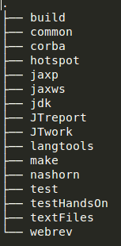

# Structure des répertoires d'OpenJDK 8

Observez la structure des répertoires de divers projets OpenJDK
(téléchargez la commande tree pour Ubuntu ou installez la via ```sudo apt-get install tree```)

Ci-dessous des sorties complètes ou partielles de la commande tree :
 
**OpenJDK (niveau 1)** <br/>
```$ tree -L 1 -d``` <br/>


**OpenJDK (niveau 2)** <br/>
```$ tree -L 2 -d``` <br/>
![[[image ou sortie de la commande ci-dessus]]](OpenJDKDirStructureLevel2.png)

**build (niveau 3)** <br/>
```
$ tree -L 3 -d build
build
└── linux-x86_64-normal-server-release
    ├── corba              ⇐ Common Object Request Broker Architecture
    │   ├── btclasses
    │   ├── btjars
    │   ├── classes
    │   ├── dist
    │   ├── gensrc
    │   ├── lib
    │   └── logwrappers
    ├── hotspot                       ⇐ Java, la plaforme (une partie)
    │   ├── dist
    │   ├── linux_amd64_compiler2
    │   └── linux_amd64_docs
    ├── images
    │   ├── j2re-image            ⇐ ce répertoire contient le JRE 
    │   ├── j2sdk-image           ⇐ ce répertoire contient le JDK
    │   ├── lib
    │   ├── local_policy_jar.tmp
    │   ├── src
    │   ├── _strip_jdk
    │   ├── _strip_jre
    │   ├── symbols
    │   ├── unsigned
    │   └── US_export_policy_jar.tmp
    ├── jaxp               ⇐ Java API for XML Processing
    ├── jaxws              ⇐ Java API for Web Services
    ├── jdk                ⇐ Java, le langage (qutre partie)
    ├── langtools          ⇐ outils de support pour Java, le langage
    ├── nashorn            ⇐ Runtime Javascript pour la JVM
    └── tmp
```
Les répertoires jaxp et suivant ont été reduits pour permettre l'affichage de la structure sur cette page.

**Hotspot (tous niveaux)**  <br/>
```$ tree -d hotspot```<br/>


Seule une vue partielle de la structure pour hotspot à été affichée sur cette page pour quelle puisse tenir dans cet aperçu.