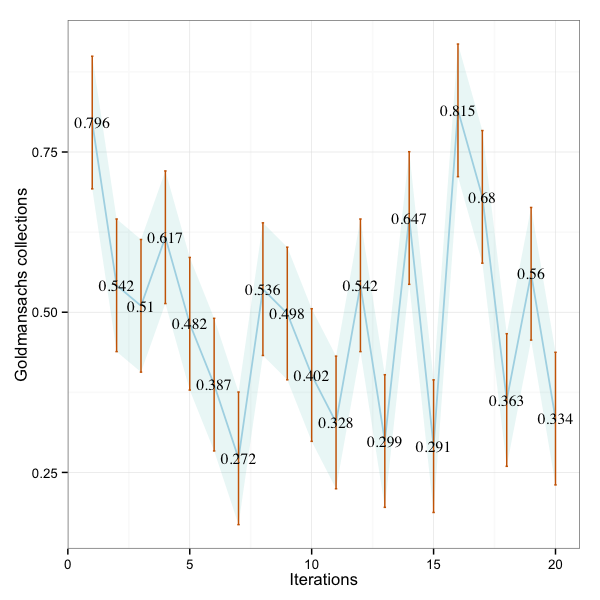

'R' est utilisé pour parser les données du benchmark JMH et construire ces graphs.

###Types des barres d'erreurs utilisées pour construire le graphique

<table>
    <thead>
    <tr>
         <td>Barre d'erreurs</td>
         <td>Type</td>
         <td>Description</td>
    </tr>
    </thead>
    <tr>
        <td>Erreur standard (SEM)</td>
        <td>Inférence</td>
        <td>Une mesure de comment sera la variabilité de la moyenne, si vous répétez l'étude complète plusieurs fois.</td>
    </tr>
    <tr>
        <td>Interval de confiance (CI)</td>
        <td>Inférence</td>
        <td>Une plage de valeurs dont vous pouvez à 99% être confiant qu'elle contient la véritable moyenne.</td>
    </tr>
</table>

###Collections Java

Résumé R

<table>
    <thead>
    <tr>
         <td>Min.</td>
         <td>1st Qu.</td>
         <td>Median</td>
         <td>Mean</td>
         <td>3rd Qu.</td>
         <td>Max.</td>
    </tr>
    </thead>
    <tr>
        <td> 0.2720</td>
		<td>0.3558</td>
		<td>0.5040</td>
		<td>0.4950</td>
		<td>0.5742</td>
		<td>0.8150</td>
    </tr>
</table>

##### R graph montrant les barres d'erreurs et les 99% CI en bande

###Collections GS

Résumé R

<table>
    <thead>
    <tr>
         <td>Min.</td>
         <td>1st Qu.</td>
         <td>Median</td>
         <td>Mean</td>
         <td>3rd Qu.</td>
         <td>Max.</td>
    </tr>
    </thead>
    <tr>
        <td>0.4860</td>
		<td>0.5780</td>
		<td>0.7970</td>
		<td>0.4950</td>
		<td>1.0060</td>
		<td>1.4770</td>
    </tr>
</table>

##### R graph montrant les barres d'erreurs et les 99% CI en bande

