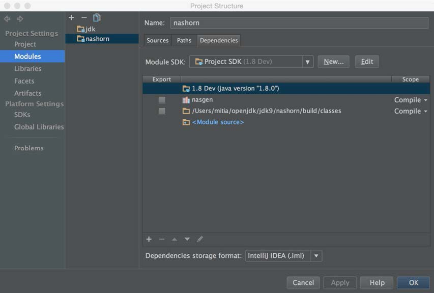

# IntelliJ

Pour voir / modifier les sources de Java à partir d'IntelliJ:
 - Depuis le menu, choisissez File> Import project
 - Naviguez vers le répertoire jdk/, qui contient les répertoires src, make et test. Par exemple /home/openjdk/dev/jdk9/jdk sur une VM Ubuntu, ou smb://server/user/dev/jdk9/jdk si vous utilisez un [partage depuis la VM dans la machine hôte](../virtual-machines/sharing_host_folder_with_guest_vm.md). Cliquez sur OK et soyez patient...
 - Alternativement choisissez un sous-répertoire des répertoires ci-dessus, tel que java.base/share/classes pour travailler sur un sous ensemble moins large.

## Script pour charger les modules depuis la repo OpenJDK dans IntelliJ
https://github.com/AdoptOpenJDK/BuildHelpers/blob/master/buildIntelliJModules.sh

## Projet Nashorn

Ces instructions sont pour OS X Yosemite et IntelliJ Idea version 14. Mais ces instructions devraient être à peu près les même pour d'autres OSs.

1 . Verifiez que vous avez le JDK 8 d'installé.

2 . Utilisez mercurial pour cloner la repo http://hg.openjdk.java.net/jdk9/dev vers le répertoire où vous voulez puis lancez get_sources.sh

3 . Créez un projet Java vide quelque part sur votre sytème mais pas dans le répertoire où vous avez cloné les sources du JDK 9.

4 . Créez un module avec comme racine “<JDK9_SOURCES>/nashorn”, et assignez ses sources à ”src/jdk/scripting/nashorn/share/classes”

5 . Partie trompeuse : La compilation, le développement et le débuggage sont effectués par rapport à JDK 8 car IntelliJ Idea 14 ne supporte pas encore le JDK 9 et le format de distribution jimage. Donc, pour éviter que le Nashorn du JDK interfère avec celui construit il est une bonne idée de créer une copie du JDK 8 sans nashorn.jar (situé sous <JDK8_ROOT>/jre/lib/ext/nashorn.jar):

6 . Maintenant ajoutez ce JDK à l'IDE :

7 .  Presque terminé. Encore une partie trompeuse : Dans Nashorn les soit disantes classes “JavaScript” sont générées. Il faut un outil spécial “nasgen” pour cela et il se trouve dans le répertoire “buildtools/nasgen”.

8 . Avant de lancer Nashorn lui-même, la cible ant nasgen “all” doit-être lancée.

9 . Ajoutez le “nasgen.jar” résultant aux dépendances du module.

10 . Naviguez vers le répertoire “<nashorn>/make” et lancez la target ant “all”.

11 . Ajoutez le répertoire résultant “<nashorn>/build/classes/” aux dépendances du module :

12 . Maintenant il est possible d'exécuter Shell.java pour explorer et débugger le code :

Le débuggage est disponible directement dans l'IDE :

Attention : Conservez à l'esprit que certaines classes – les soit disante classes “JavaScript” sont générées. Leur classes de “bootstrapping” sont annotées avec @ScriptObject. Prenez un peu de temps pour les explorer. Elles ne peuvent être débugger depuis cette perspective. Mais “sout” peut aider.