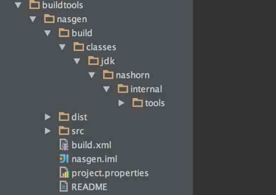

# IntelliJ

Para ver/editar fontes Java no IntelliJ:
 - No menu, selecione File > Import project
 - Procure pelo diretorio jdk/, que contenha o src, make e test. Examplo /home/openjdk/dev/jdk9/jdk no Ubuntu VM, or smb://server/user/dev/jdk9/jdk se voce estiver usando a opção de vm compartida com a [host machine](../virtual-machines/sharing_host_folder_with_guest_vm.md). Aperte OK e espere. Seja paciente, pode tardar um pouquinho.
 - Outra alternativa é escolher um sub-diretorio descrito acima, por exemplo java.base/share/classes e trabalhar apenas com ele, seria um sub-set dos fontes e deve carregar mais rapidamente.

## Script para carregar modulos do JDK (OpenJDK repo) dentro do IntelliJ
https://github.com/AdoptOpenJDK/BuildHelpers/blob/master/buildIntelliJModules.sh

## Projeto Nashorn

Os passos abaixo foram testados em um OS X Yosemite com IntelliJ Idea 14.
Porém acreditamos que para outros sistemas operacionais, estes passos devem ser muito similares, se não, iguais.

1 . Verifique se o JDK8 esta instalado.

2 . Via mercurial clone o repositorio http://hg.openjdk.java.net/jdk9/dev para o diretorio desejado e execute get_sources.sh

3 . Crie um projeto Java em qualquer local do seu computador menos no diretorio onde estão os fontes do JDK9.

4 . Copie e cole os conteúdos da pasta “<JDK9_SOURCES>/nashorn”, e aponte os fontes para ”src/jdk/scripting/nashorn/share/classes”

5 . A parte mais complicada: A compilação, desenvolvimento e debugging atualmente é feito através do JDK8. Infelizmente a IDE Idea 14 não suporta JDK9 e a jimage distribution mechanism. Então, de maneira que o JDK’s Nashorn não interfira com o que nós fizemos, é uma boa ideia fazer uma nova copia do JDK8 e remover o nashorn.jar do JDK que esta localizado em <JDK8_ROOT>/jre/lib/ext/nashorn.jar:

6 . Agora adicione o JDK na IDE:

7 .  Estamos quase lá. Existe mais uma parte complicada: Para gerar as chamadas “JavaScript” classes, existe uma ferramenta especial chamada “nasgen”. Esta ferramenta esta localizada no diretorio “buildtools/nasgen”.

8 . Antes de rodar o Nashorn, confirme que a task Ant nasgen “all” foi executada e finalizada com sucesso.

9 . Adicione o arquivo gerado “nasgen.jar” nos "module dependencies".

10 . Navegue até o diretorio “<nashorn>/make” e rode a task Ant “all”.

11 . Adicione as classes compiladas dentro do diretorio “<nashorn>/build/classes/” a "module dependencies":

12 . Agora sim, é possivel executar o Shell.java, explorar e debugar o codigo:

Debugging esta disponível diretamente dentro da IDE :

Aviso: Considere que, alguma dessas classes – as chamadas “JavaScript” classes foram geradas. O “bootstrapping” destas classes está annotado com a anotação @ScriptObject. De uma olhada e explore bem este tópico. Estas não podem ser debugadas desta maneira. Porém “sout” pode ajudar.