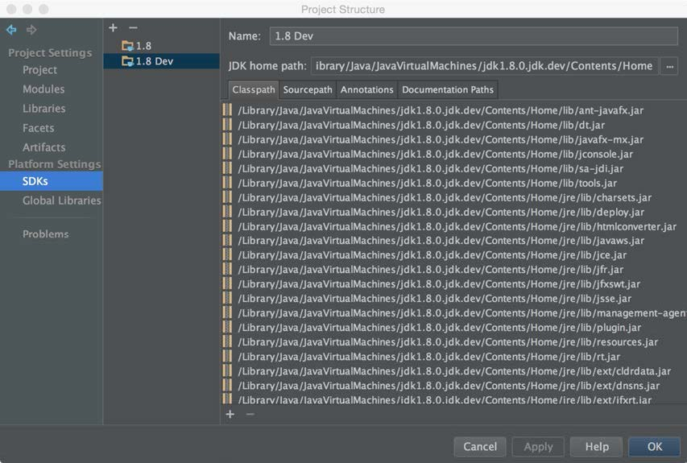
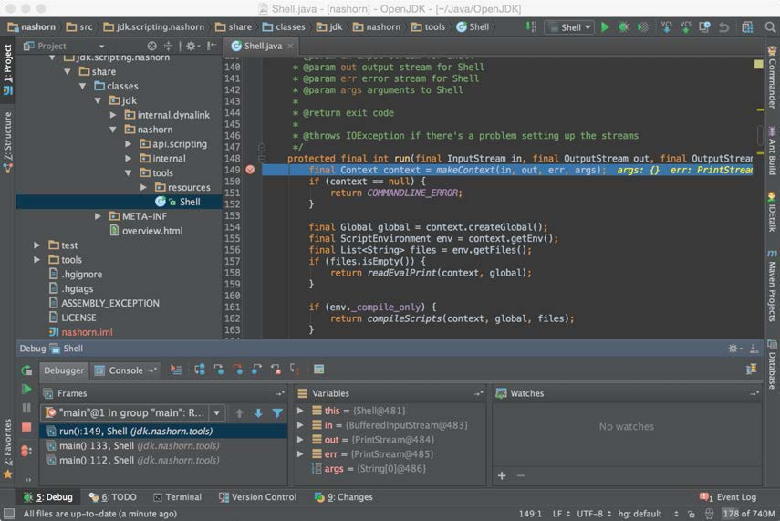

# IntelliJ

To view / edit Java source files from IntelliJ:
 - From the menu choose File> Import project
 - Browse to the jdk/ folder, which contains the src, make and test folders. For example /home/openjdk/dev/jdk9/jdk on a Ubuntu VM, or smb://server/user/dev/jdk9/jdk if you are using a [share from VM into the host machine](../virtual-machines/sharing_host_folder_with_guest_vm.md). Press OK and be patient.
 - Alternatively choose a sub-folder of the above, such as java.base/share/classes to work with a smaller sub-set.

## Script to load modules from the JDK repo (OpenJDK repo) into IntelliJ
https://github.com/AdoptOpenJDK/BuildHelpers/blob/master/buildIntelliJModules.sh

## Nashorn project

The current setup is made on OS X Yosemite and IntelliJ Idea version 14. But the setup for other OSs should run almost the same way.

1 . Verify you have JDK8 installed.

2 . Using mercurial clone the repository http://hg.openjdk.java.net/jdk9/dev to the folder you want and execute get_sources.sh

3 . Create an empty Java project somewhere in your system but NOT in the folder where the pulled JDK9 sources are.

4 . Make a project module with root “<JDK9_SOURCES>/nashorn”, and assign sources to” src/jdk/scripting/nashorn/share/classes”

5 . A bit tricky part: The compilation, development and debugging currently is done against JDK8 since the IDE Idea 14 does not support JDK9 and the jimage distribution mechanism. So, in order JDK’s Nashorn not to interfere with one we build it’s a good idea to make a new copy of JDK8 and to remove the nashorn.jar from the JDK located under <JDK8_ROOT>/jre/lib/ext/nashorn.jar:

6 . Now add this JDK to the IDE:

7 .  Almost done. Another tricky part: In Nashorn the so called “JavaScript” classes are been generated. There is a special tool “nasgen” for that and it is locates in the “buildtools/nasgen” directory.

8 . Before running the Nashorn itself the nasgen “all” ant target should be run.

9 . Add the resulting “nasgen.jar” to the module dependencies.

10 . Navigate to “<nashorn>/make” folder and run the “all” ant target.

11 . Add the resulting classed in “<nashorn>/build/classes/” to the module dependencies:

12 . Now it is possible to run the Shell.java to explore and debug the code:

Debugging is available directly in the IDE :

Warning: Have in mind that some of classes – so called “JavaScript” classes are been generated. Their “bootstrapping” classes are annotated with @ScriptObject. Take some time to explore them. They cannot be debugged from that perspective. But “sout” might help.