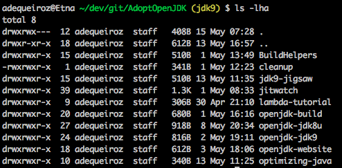

# Compilando a OpenJDK8 no Mac, usando inception.

Voce pode ver uma outra versão desse tutorial [aqui](http://allandequeiroz.io/2017/05/15/building-openjdk-8-on-mac-inception-approach)

Esse é um meio alternativo para compilar a OpenJDK8 em versões recentes do OSx.

Diferentemente da OpenJDK 9 onde é possível utilizar as versões mais recentes do XCode para compilar a JDK, a OpenJDK 8 continua a utilizar XCode4, caso você esteja enfrentando problemas para fazer isso na sua própria máquina usando as flags xcode-select or --with-xcode-path você pode tentar através dessa alternativa.

Nesse tutorial nós utilizamos VirtualBox 5.1.22, todas as configurações necessárias relacionadas a compilação da JDK tais como, XCode e freetype já estão prontas na adopt-openjdk-jdk8u-build VM, então primeiramente faça os seguintes downloads.

[http://download.virtualbox.org/virtualbox/5.1.22/VirtualBox-5.1.22-115126-OSX.dmg](http://download.virtualbox.org/virtualbox/5.1.22/VirtualBox-5.1.22-115126-OSX.dmg)

[https://goo.gl/Iw838n](https://goo.gl/Iw838n)

# Potenciais problemas

Para evitar que você fique maluco tentando resolver problemas com o boot, vamos ver como soluciona-lo caso aconteça.

Caso você veja qualquer coisa differente disso


Feche a janela da VirtualBox sem salvar o estado atual


Inicie novamente pressionando **F12**, você verá a "BIOS",  selecione **Boot Manager**, **EFI Hard Drive** e **Continue**


# Configurações ( Somente na primeira vez )

### HOST (Na sua máquina)
    
Depois de instalar a VirtualBox, você será capaz de importar a adopt-openjdk-jdk8u-build para iniciar o processo.

**System Preferences -> Users & Groups**

Crie um novo usuário to tipo "Sharing Only"


Para facilitar, vamos criar um usuário como mesmo nome do existente na VM

- login : adoptopenjdk
- password : adoptopenjdk

**System Preferences -> Sharing**

Selecione o diretório onde os fontes da JDK se encontram, nesse caso AdoptOpenJDK


Adicione o novo usuário a essa lista, isso será necessário para montar o compartilhamento dentro da VM.

De permissão de leitura aos membros do staff

```
chmod -R g+w AdoptOpenJDK/
```



Inicie a **adopt-openjdk-jdk8u-build** VM


### VM (Máquina Virtual)

Abra o Finder na VM, você verá que a sua máquina está listada do lado esquerdo em  **sharing**, clique no diretório compartilhado e quando perguntado, utilize o login e senha atrelado ao usuário criado na sua máquina "Host".

- login : adoptopenjdk
- password : adoptopenjdk

Agora, para montar o compartilhamento automaticamente sempre que a VM for inicializda va até *System Preferences -> Users & Groups**, encontre o usuário adoptopenjdk, vá a Login Items e adicione o diretório recém montado **/Volumes/AdoptOpenJDK**


Para facilitar, você poderá criar um link para outro lugar, exemplo de **/Volumes/AdoptOpenJDK** para **/Users/adoptopenjdk/dev**


Caso você queira faer isso, crie um novo diretório e em seguida o link

```
mkdir ~/dev
ln -sf /Volumes/AdoptOpenJDK ~/dev/AdoptOpenJDK
```

Agora basta iniciar o processo de compilação, vá ao diretório openjdk-jdk8u e execute

```
bash configure
make images
```

Utilizando as configurações correntes, esse processo pode levar cerca de uma hora


